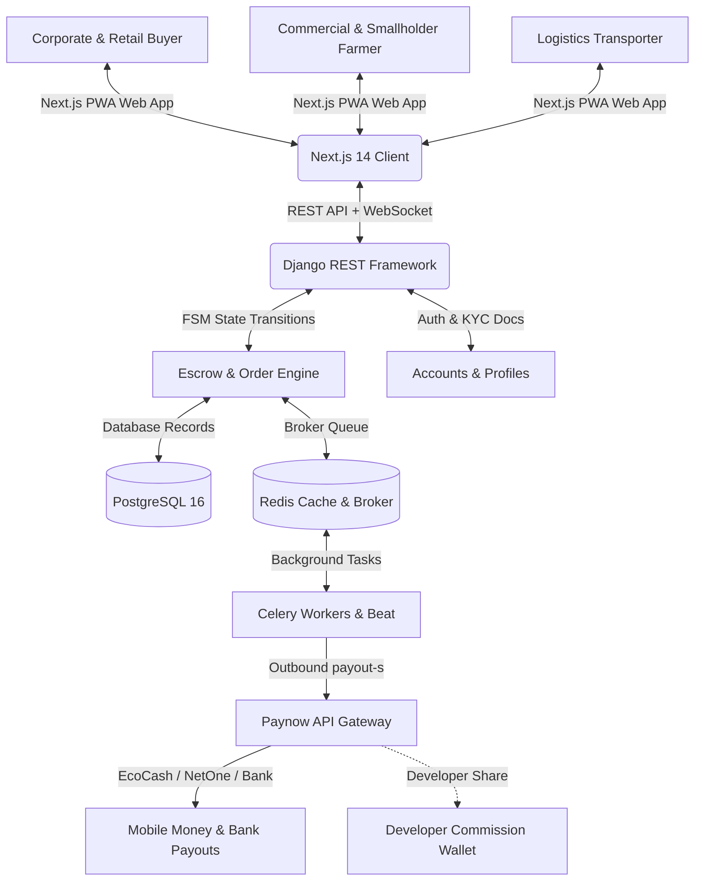

# AgriMarket ZW 🌾

**Zimbabwe's Premier Agricultural Operating System & Peer-to-Peer Escrow Platform.**

AgriMarket ZW is an enterprise-grade SaaS marketplace and direct agricultural trade network. The platform connects smallholder and commercial farmers directly to retail buyers, corporate food processors, and exporters—eliminating predatory off-grid middlemen. Sourcing transactions are secured via a Paynow-integrated **Dual-Signature Escrow** vault with built-in **ZIMRA tax compliance** and **automated mobile payout splitting** for developer monetization.

---

## 🏗️ Technical Architecture & Ecosystem

AgriMarket operates on a decoupled Next.js and Django microservices model:



### Module Stack
* **Frontend**: Next.js 14 App Router, TypeScript, Zustand (State Management), Recharts (Agronomic Curves), Service Workers (Progressive Web App).
* **Backend**: Django 4.2+ & Django REST Framework, django-fsm (Finite State Machine), PostgreSQL 16, Redis 7, Celery 5 (Asynchronous Tasks & Beat scheduler).
* **APIs**: Paynow Zimbabwe API (Payment gateway & Outbound B2C payouts), Africa's Talking SMS API (Agricultural weather dispatches).

---

## 📦 Project Directory Structure

```
AgriMarket/
├── backend/
│   ├── apps/
│   │   ├── accounts/       # KYC, profiles, payout settings, and user model
│   │   ├── contracts/      # Bulk pre-season crop forward contracts
│   │   ├── listings/       # Retail (kg) and Wholesale (tonnes) inventory listings
│   │   ├── logistics/      # Cargo load pooling channels and route matching
│   │   ├── market_data/    # Live Mbare Musika prices & weather preset models
│   │   ├── messaging/      # Django Channels chat websockets & VoIP logs
│   │   ├── notifications/  # SMS and Email dispatch log registers
│   │   ├── orders/         # Order state, EscrowTransactions, and EscrowLogs
│   │   └── payments/       # Webhooks, Paynow transaction triggers, and Celery payouts
│   └── config/             # Django settings (local, production, base)
└── frontend/
    ├── app/                # Next.js 14 App Router Pages
    │   ├── agronomist/     # AI Agronomist diagnostic laboratory portal
    │   ├── arbitrage/      # Buyer Arbitrage Price Index & Zimbabwe Heatmap
    │   ├── dashboard/      # Role-specific protected dashboards (farmer, buyer, admin)
    │   ├── forecaster/     # AI Crop Yield response curve simulator (Recharts)
    │   ├── invoice/        # Official ZIMRA Compliant Tax Invoice templates
    │   ├── logistics/      # Logistics Load Pooling & Fleet Radar Tracking
    │   ├── messages/       # Encrypted VoIP calling & Attachment hub chat
    │   ├── orders/         # Escrow milestone tracker & checkout
    │   └── weather/        # Weather satellite radar & SMS dispatch subscriptions
    ├── components/         # Shared React Components (StatCard, EscrowTracker, etc.)
    └── lib/                # Zustand currencyStore & axios api instances
```

---

## ⚖️ ZIMRA Tax Compliance & Financial Logic

The billing ledger is designed to meet ZIMRA VAT regulations (*Value Added Tax Act of Zimbabwe [Chapter 23:12]*):

### 1. VAT Status of Commodities
* Raw, unprocessed agricultural grain and oilseeds (Maize, Wheat, Soybeans, Sorghum) are classified under the **Second Schedule** as **Zero-Rated / Exempt**. No VAT is calculated or levied on the raw crop price.

### 2. Platform Escrow Services
* AgriMarket charges a flat **2.5% Platform Escrow Service Fee** on the crop subtotal to secure Paynow transactions.
* This service fee is standard-rated; a **15% VAT** is calculated and charged *exclusively* on the 2.5% platform fee.

### 3. Compliant Calculations Ledger (Example)
For a farmer listing crop quantity worth **$100.00 USD**:
1. **Crop Subtotal (Zero-Rated)**: `$100.00`
2. **Platform Escrow Fee (2.5%)**: `$2.50`
3. **VAT on Platform Fee (15% of $2.50)**: `$0.38`
4. **Total Escrow Amount Held (Charged to Buyer)**: `$102.88`

---

## 💰 Developer Monetization & Commission Split

AgriMarket includes a split-payout system inside the Celery task scheduler to automate SaaS developer earnings:

1. **Transaction Entry**: The buyer pays the gross total (crop subtotal + platform fee + tax = `102.875%` of crop price) into the Paynow escrow account.
2. **Escrow Lock**: Funds remain held in the platform's central Paynow vault while crop delivery is in progress.
3. **Escrow Payout Release**:
   * When the escrow is confirmed **RELEASED** by both parties, the Celery background worker (`process_escrow_payout` in [tasks.py](file:///c:/Users/TafadzwaNjagu/Documents/SoulZ Systems Projects/AgriMarket/backend/apps/payments/tasks.py)) executes.
   * The worker calculates the farmer's net payout amount: **exclusively the crop subtotal price** (`order.total_price_usd_cents`).
   * Paynow transfers the crop subtotal price to the farmer's mobile wallet (EcoCash/OneMoney) or bank account.
   * **Developer Commission**: The remaining platform fee (2.5%) and ZIMRA VAT (15%) are retained inside the platform owner's corporate Paynow balance, accumulating dev SaaS earnings automatically.
   * If a transaction is disputed and **REFUNDED**, the buyer is refunded the full gross amount (`escrow.amount_cents`) to preserve platform trust guarantees.

---

## 🔒 Escrow State Machine (django-fsm)

All trades go through a secure finite state machine inside `EscrowTransaction` to protect buyers and sellers from credit default:

```
    [ PENDING ] 
         │  
   (hold_payment) -> Confirm Paynow Webhook
         │
         ▼
     [ HELD ] ──── (dispute_payment) ───► [ DISPUTED ]
         │                                      │
  (release_payment)                      (refund_payment)
         │                                      │
         ▼                                      ▼
    [ RELEASED ]                           [ REFUNDED ]
 (Outbound Payout)                      (Full Buyer Payout)
```

---

## 🚀 Running the App Locally (Development)

Follow these instructions to run the Next.js frontend and Django backend servers in a local environment:

### Prerequisites
1. Python 3.10+ installed.
2. Node.js 18+ installed.
3. Redis Server running locally (or via Docker on Port 6379).

### 1. Start backend server
```bash
cd backend
python -m venv venv
venv\Scripts\activate
pip install -r requirements.txt
python manage.py migrate --settings=config.settings.local
python manage.py seed_commodities --settings=config.settings.local
python manage.py runserver --settings=config.settings.local
```

### 2. Start Celery worker & beat
```bash
# In a new terminal tab (within backend/):
celery -A config worker --loglevel=info -Q payments,celery --settings=config.settings.local

# In another terminal tab (within backend/):
celery -A config beat --loglevel=info --settings=config.settings.local
```

### 3. Start Next.js frontend
```bash
cd frontend
npm install
npm run dev
```
Navigate to `http://localhost:3000` to interact with the web platform.

---

## 🧪 Verification & Testing

### Running Django backend unit tests
Execute the suite of 23 unit tests verifying listings, KYC, orders, state machine triggers, and Paynow callbacks:
```bash
cd backend
python manage.py test apps --settings=config.settings.local
```

### Running Next.js compilation check
Confirm that the build pipeline compiles all pages successfully:
```bash
cd frontend
npm run build
```

---

## 🇿🇼 Standard Seeding and Staging Accounts
To test the full user flow (Smallholder, Commercial Farmer, Buyer, Transporter), refer to the table below:

| Role | Phone Number | Password | Features to Test |
| :--- | :--- | :--- | :--- |
| **System Administrator** | `+263771111111` | `Password123!` | KYC Document Vetting, System Analytics, Price Index Calibration. |
| **Commercial Farmer** | `+263772222222` | `Password123!` | Create Crop Listings, Run Yield Simulator, Register Weather SMS alerts. |
| **Corporate Buyer** | `+263773333333` | `Password123!` | Post Wholesale RFQs, Sourcing Arbitrage Radar, Paynow Escrow checkouts. |
| **Logistics Transporter** | `+263774444444` | `Password123!` | Fleet Radar Map tracking, Cargo Load Pooling. |

---

*Designed by Antigravity AI & Tafadzwa.*
